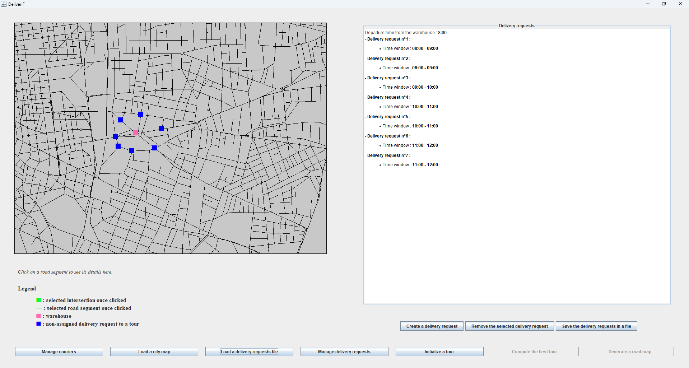
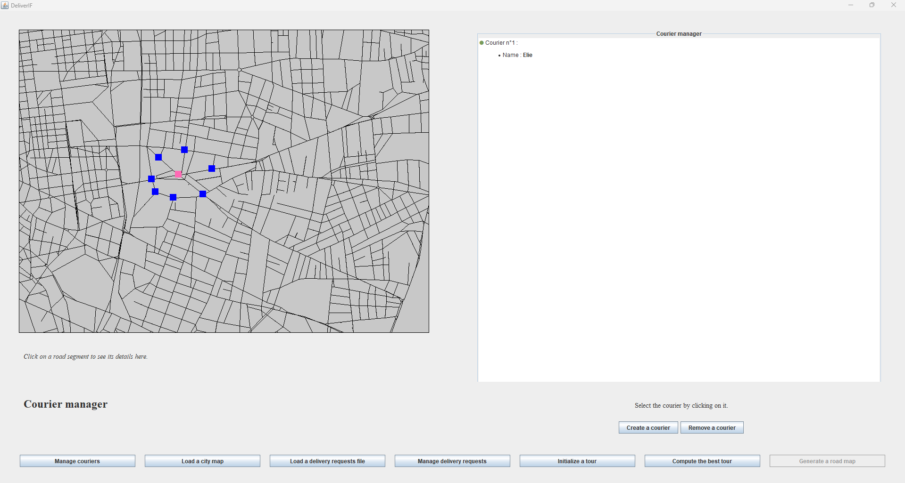
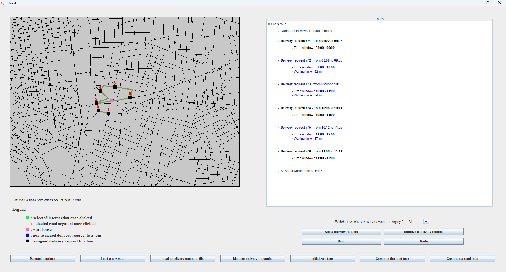

# DeliverIF

## Introduction

DeliverIF is a delivery management application designed to optimize delivery routes within a city. It allows the loading of city maps, delivery requests, creation and assignment of delivery requests to routes, optimization of routes, and generation of delivery itineraries for couriers.

## Application Screenshots

Here are some key screenshots from the DeliverIF application, showcasing its core functionalities:

- **Load Map**: Import and display a city map for route planning.

- **Load Delivery Request**: Upload and display delivery requests on the map.

- **Manage Couriers**: Easily manage couriers and assign them to routes.

- **Compute Best Tour**: Optimize and calculate the best delivery route for couriers.

## Glossary

### Key Terms

- **City Map**: A detailed 2D representation of a city's geographical layout.
- **Courier**: Individuals responsible for transporting and delivering parcels by bike within the city.
- **Route**: An optimized path followed by a courier to complete a series of deliveries.
- **Time Window**: A one-hour time slot during which a specific delivery must be made.
- **Warehouse**: The central location where couriers begin and end their delivery routes.
- **XML File**: Files used to load city maps, delivery requests, and previously saved routes.

## Structured Descriptions of Key Use Cases

### 1. Load a City Map

**Description**: Load a selected city map XML file into the application for the delivery planner.

**Actors**: Delivery Planner, File System

**Preconditions**: The application is successfully launched and ready to receive input from the delivery planner.

**Postconditions**: The city map is loaded into the application, providing necessary geographical data for route planning.

**Main Scenario**:
1. The delivery planner clicks on the "Load City Map" button.
2. The system opens a file dialog.
3. The delivery planner selects a city map XML file.
4. The system loads the selected XML file.
5. The system displays the map based on the data from the XML file.

### 2. Load Delivery Request File

**Description**: Load a selected delivery request XML file into the application.

**Actors**: Delivery Planner, File System

**Preconditions**:
- The application is successfully launched and ready to receive input from the delivery planner.
- A city map has been loaded into the application.

**Postconditions**: Delivery locations from the selected request file are displayed on the city map.

**Main Scenario**:
1. The delivery planner clicks on the "Load Delivery Requests" button.
2. The system opens a file selection window.
3. The delivery planner selects a delivery request XML file.
4. The system loads the selected XML file.
5. The system adds the loaded delivery requests to the available requests.

### 3. Create a Delivery Request

**Description**: Create a new delivery request by selecting an intersection and a time window.

**Actors**: Delivery Planner

**Preconditions**:
- The application is successfully launched and ready for input.
- A city map has been loaded into the application.
- A delivery request has been assigned to the selected courier.
- At least one route has been successfully calculated.

**Postconditions**: A route sheet is generated for each existing route.

**Main Scenario**:
1. The user clicks on the "Create Delivery Request" button.
2. The delivery planner selects a time window.
3. The planner selects an intersection on the city map.
4. The planner specifies if it is a warehouse.
5. The planner clicks "Validate the Created Delivery Request."
6. The system adds the newly created request to the available delivery requests.

## MVC Architecture and Design Patterns

### MVC

The Model-View-Controller (MVC) approach was chosen to ensure the application's maintainability, scalability, and long-term flexibility. This architecture separates the application into three distinct concerns:

1. **Model**: Manages and manipulates the necessary entities.
2. **View**: Handles the user interface and data presentation.
3. **Controller**: Adjusts the model to the view.

### Design Patterns

- **Command**: Encapsulates a request as an object, allowing users to configure clients with different requests, queue them, and support undoable operations.
- **State**: Enables changing the context of the application by navigating between allowed modes.
- **Observer**: Used for the UI to respond to mouse input and highlight selected components, improving performance when handling many objects.

## Testing Report

Tests are conducted to ensure the application's proper functionality and prevent regression.

## Technical Review

A thorough technical analysis has been performed to evaluate the efficiency and performance of the application.

## Environmental and Social Considerations

Environmental and social implications have been reviewed to ensure that the application positively contributes to society and minimizes environmental impact.

## Personal Review and Feedback

Team members have shared their personal feedback and comments on the project, providing insights into the challenges encountered and lessons learned.

---

For further details, please refer to the full documentation available in the `documentation` folder.
